# Day 25: RxJS Higher Order Observables and Utility Operators

Whoa, chúng ta đã cùng nhau tìm hiểu gần hết các **Operators** thường (có thể thường) sử dụng trong ứng dụng **Angular** rồi, còn mấy cái nữa thôi 💪. Ngày hôm nay, chúng ta sẽ cùng nhau tìm hiểu 2 (trong 3) loại **Operators** cuối cùng là: **RxJS Higher Order Observables** và **Utility Operators** nhé.

> [!NOTE]
> **Lưu ý về Import từ RxJS v7.2+:**
> Tất cả các operators (`switchMap`, `mergeMap`, `concatMap`, `exhaustMap`, `tap`, `delay`, `finalize`, `repeat`, `timeout`, `partition`) và utility functions (`firstValueFrom`, `lastValueFrom`) hiện nay đều được import trực tiếp từ package chính `'rxjs'`. Không còn sử dụng đường dẫn `'rxjs/operators'`.

> Loại **Operator** còn lại là **Multicasting Operator** và đây là loại **Operator** chúng ta sẽ tìm hiểu vào ngày kế tiếp

## RxJS Higher Order Observables (HOOs)

**HOOs** là những operators mà sẽ nhận vào giá trị của **Outer Observable** (hay còn gọi là **Source**) và sẽ trả về một **Inner Observable** (hay còn gọi là **Destination**) khác. Nhắc lại ngày trước 1 chút, chúng ta đã cùng tìm hiểu về `map()`, là **Transformation Operator**

```ts
interval(1000)
  .pipe(map((val) => val * 2))
  .subscribe(console.log);
// output: 0 -- 2 -- 4 -- 6 -- 8
```

Các bạn sẽ thấy là `map()` dùng giá trị của `interval(1000)` là `0 -- 1 -- 2 -- 3 -- 4...` và trả về giá trị mới là nhân đôi của giá trị ban đầu `0 -- 2 -- 4 -- 6 -- 8...`. **HOOs** cũng là những **Transformation Operators** nhưng thay vì `transform` thành `value` mới thì chúng sẽ trả về `Observable` mới để chúng ta có thể `subscribe` vào `Observable` mới này và lấy giá trị mới.

#### Nguồn gốc của các HOOs?

Trước khi tìm hiểu về cái HOOs, chúng ta sẽ tìm hiểu các operators sau: `mergeAll()`, `concatAll()`, và `switchAll()`. Như mình vừa nói qua ở trên, operator `map()` dùng để chuyển giá trị được emit từ `Source Observable` sang 1 giá trị mới rồi emit giá trị mới này. Ở ví dụ trên, chúng ta thấy `map()` trả về 1 giá trị bình thường. Vậy trường hợp `map()` trả về giá trị là 1 `Observable` thì sao? Chúng ta hãy thử nhé.

```ts
fromEvent(document, 'click')
  .pipe(map(() => interval(1000)))
  .subscribe(console.log);
// Click
// output: Observable {}
// Click
// output: Observable {}
// Click
// output: Observable {}
```

Như các bạn thấy, chúng ta nhận được `Observable {}` ở trên Console. Lí do là vì `map()` trả về 1 `Observable`, là `interval(1000)` ở đây. Và lúc này các bạn đang có 1 **Higher Order Observable** (aka `Observable<Observable>`). Các bạn có thể hiểu là mỗi lần click, chúng ta sẽ có 1 `interval()` mới. Lúc này, chúng ta có thể dùng 1 trong 3 operators mình vừa liệt kê ở trên để `pipe` vào `Source Observable` này:

```ts
const source = fromEvent(document, 'click').pipe(map(() => interval(1000)));

source.pipe(mergeAll()).subscribe(console.log);
source.pipe(switchAll()).subscribe(console.log);
source.pipe(concatAll()).subscribe(console.log);
```

Cả 3 `merge/switch/concatAll` sẽ giúp các bạn chuyển **Higher Order Observable** về lại **First Order Observable** bằng cách sẽ `subscribe` vào `Observable` mà `map()` trả về. Nói cách khác, các **Higher Order Observables** chính là `merge/switch/concatAll + map()`. Cách thức hoạt động cũng như tính chất của `merge/switch/concat` khác nhau như thế nào thì chúng ta sẽ tìm hiểu qua các **Higher Order Observables** nhé.

#### Tại sao lại cần HOOs?

Chúng ta xem qua ví dụ sau:

```ts
this.queryInput.valueChanges.pipe(debounceTime(500)).subscribe((query) => {
  this.apiService.filterData(query).subscribe((data) => {
    /*...*/
  });
});
```

Chúng ta có một use-case rất quen thuộc: một `FormControl` là `queryInput` dùng để xử lý một **Text Input**. Chúng ta cần lắng nghe vào `valueChanges` trên `FormControl` này để thực hiện việc gọi backend với `query` mới. Nhưng các bạn có thấy điều gì sai sai không? Đó là chúng ta đã vi phạm một trong những lỗi dễ gặp nhất khi làm việc với **RxJS**: Nested Subscription, hay còn gọi là Subscribe-in-Subscribe.

Tại sao điều này không tốt? Để hiểu được chúng ta cần phải hiểu là `Observable` sẽ không làm gì cho đến khi `subscribe`. Khi bạn `subscribe` vào 2 `Observable` lồng vào nhau như thế này, 2 `Observable` này bắt đầu _next_ value _các kiểu con đà điểu_ hoàn toàn tách biệt, không liên quan gì đến nhau. Thử hình dung các bước sau:

1. Người dùng type: `"abc"` vào `queryInput` và ngừng type.
2. Sau 500ms (`debounceTime()`), `valueChanges` emit giá trị `abc` và chúng ta `subscribe` vào `valueChanges` với `observer`: `query => {...}`
3. Từ `query`, chúng ta ngay lặp tức gọi `apiService.filterData(query)` và đây cũng là 1 `Observable`, nên chúng ta `subscribe`.
4. Sau 1 khoảng thời gian ngẫu nhiên (vì là API request mà, hên xui 😅), chúng ta có `data` và bắt đầu hiển thị lên template.

Mọi thứ đều đẹp như mơ, cho đến khi có thêm các bước như sau.

5. Người dùng xoá `abc` đi và type vào `xyz`. Mọi thứ diễn ra dưới 500ms và người dùng dừng lại ở `xyz`.
   6-7. Như bước 2 và 3, chúng ta có `query` với giá trị là `xyz` và sẽ gọi `apiService.filterData(query)`. (tạm gọi đây là {1})
6. Sau 1 khoảng thời gian **KHÁ LÂU**, người dùng lại tiếp tục đổi `query` từ `xyz` thành `abcxyz`.
7. Sau 500ms, chúng ta lại có `query` là `abcxyz` và sẽ tiếp tục gọi `apiService.filterData(query)` (tạm gọi đây là {2})
8. Lúc này, {1} hoàn tất và chúng ta có `data`. Hiển thị lên template nhưng hỡi ơi, `data` của {1} là `data` mà liên quan đến `query = 'xyz'` cơ mà. Hiện tại `query` là `abcxyz` mất rồi. Thế là bạn nhận ra behavior của đoạn code trên có Racing Condition trầm trọng.

Trên đây chỉ là 1 ví dụ trong vô vàn ví dụ vì sao Nested Subscription là không tốt. Lí do ở đây chính là đối với Nested Subscription, chúng ta không thể quản lý cả 2 `Observable` và làm cho chúng đồng bộ với nhau được, cho nên các bạn nên **tránh** cái lỗi ngớ ngẩn này ra. Và cách **tránh** tốt nhất chính là hiểu + áp dụng **HOOs**

#### switchMap()

`switchMap<T, O extends ObservableInput<any>>(project: (value: T, index: number) => O): OperatorFunction<T, ObservedValueOf<O>>`

> [!NOTE]
> Tham số `resultSelector` (tham số thứ 2 cũ) trong `switchMap`, `mergeMap`, `concatMap`, `exhaustMap` đã bị **DEPRECATED** từ RxJS 7. Khuyên dùng toán tử `.pipe(map(...))` bên trong inner observable.

`switchMap()` là một trong những HOOs được dùng nhiều nhất trong **RxJS** cũng như trong ứng dụng **Angular**. `switchMap()` sẽ nhận vào một `projectFunction` mà sẽ nhận vào giá trị được emit từ `Outer Observable` và sẽ phải trả về 1 `Observable` (`Inner Observable`) mới. Giá trị cuối cùng của `Outer Observable` khi dùng với `switchMap()` sẽ là giá trị mà `Inner Observable` emit. Vì đây là HOO đầu tiên nên mình sẽ cố giải thích kĩ càng và đầy đủ hơn. Các bạn hình dung case sau:

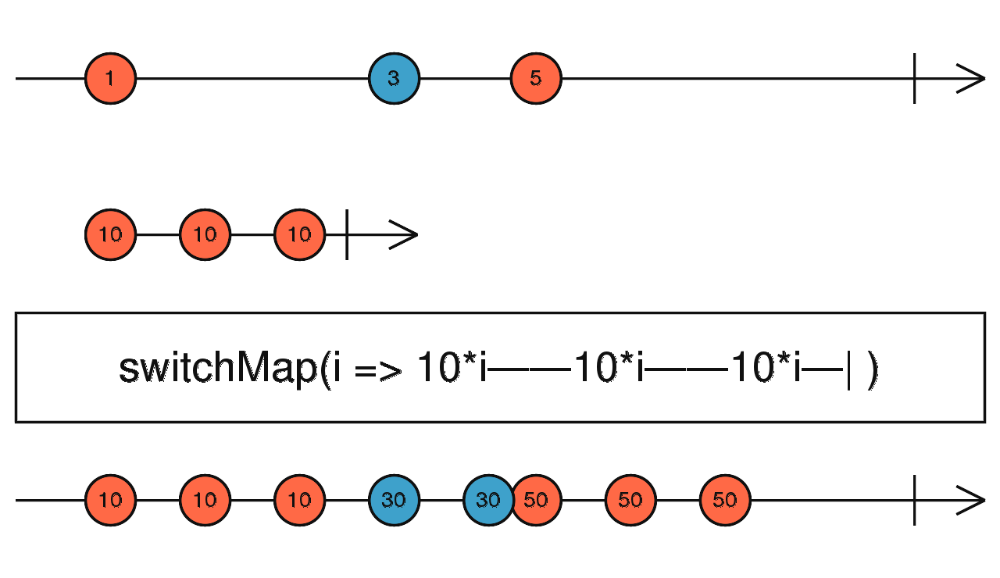

```ts
fromEvent(document, 'click').pipe(
  switchMap(() => interval(1000).pipe(take(10)))
);
```

- `fromEvent(document, 'click')`: Rất đơn giản. Tạo 1 `Observable` từ sự kiện `click` lên `document`. Mỗi lần `click` sẽ emit 1 giá trị (giá trị ở đây sẽ là `MouseEvent` nhưng chúng ta không quan tâm đến nhé)
- `interval(1000).pipe(take(10))`: Chúng ta đã tìm hiểu khá nhiều về `interval` và `take` trong những ngày qua. Dòng này sẽ trả về 1 `Observable` emit 1 giá trị mỗi giây và sẽ complete sau 10 giây. Việc này là để fake 1 request tốn 10s mới complete. Và dùng `interval` để chúng ta có thể theo dõi được giá trị được emit thay vì dùng `timer`.
- Mình `pipe(switchMap())` vào `Outer Observable` là `fromEvent()` rồi return `Inner Observable` là `interval()`. Các bạn hãy hiểu là khi `Outer Observable` emit giá trị mới thì một `Inner Observable` được trả về, và `switchMap()` sẽ `subscribe` vào `Inner Observable` mới này. Ví dụ: mình click 2 lần, chúng ta sẽ có 2 `Inner Observable`.

Tính chất của `switchMap()` là sẽ `unsubscribe` vào `Inner Observable` hiện tại khi một `Inner Observable` mới được return. Nói cách khác, `switchMap()` sẽ chỉ giữ 1 và chỉ 1 `Subscription` bất cứ lúc nào. Bây giờ chúng ta sẽ cùng thực hiện các bước sau với đoạn code trên và phân tích kết quả cũng như behavior của `switchMap()` nhé:

1. Click lên Document. Lúc này, `Outer` emit, dẫn đến 1 `interval()` được return cho `switchMap()`. Mình tạm gọi `interval()` này là `{1}`.
2. `switchMap()` bắt đầu `subscribe` vào {1}
3. Console bắt đầu hiển thị giá trị của {1}: `0 -- 1 -- 2 -- 3 -- 4 ...`. Các bạn nhớ là `interval()` này sẽ tốn 10s để complete nhé.
4. Ở giây thứ 5 - 6 gì đó, chúng ta lại Click lên Document lần nữa. Điều này sẽ làm cho `Outer` emit lần thứ 2, dẫn đến 1 `interval()` mới được return cho `switchMap()`, tạm gọi đây là {2}
5. `switchMap()` đang `subscribe` vào {1}, nhận thấy có `Observable` mới là {2}, sẽ ngay lặp tức `unsubscribe` khỏi {1} và `subscribe` vào {2}.
6. Nhìn vào Console, chúng ta sẽ thấy giá trị lặp lại từ: `0 -- 1 -- 2 -- 3 ...`. Lí do là đây là giá trị của {2}, là 1 `interval()` mới cho nên giá trị sẽ bắt đầu chạy từ số 0.

Qua phân tích như trên, các bạn đã thấy rằng `switchMap()` sẽ `unsubscribe` `Inner Observable` nếu như `Inner Observable` đang được `subscribe` chưa complete **MÀ** `Outer Observable` lại emit tiếp. Điều này cực kỳ hữu dụng nếu như chúng ta áp dụng `switchMap()` cho ví dụ `queryInput` ở trên. Có phải là nếu dùng `switchMap()`, mỗi lần `queryInput` có giá trị mới, `switchMap()` sẽ `unsubscribe` thằng `apiService.filterData()` mà chưa complete không? Vì trên thực tế, nếu `query` thay đổi thì `data` được filter theo `query` cũ chúng ta đâu cần quan tâm làm gì. Các bạn thử dùng `switchMap()` cho ví dụ đầu tiên rồi chạy xem sao nhé:

```ts
this.queryInput.valueChanges
  .pipe(
    debounceTime(500),
    switchMap((query) => this.apiService.filterData(query))
  )
  .subscribe((data) => {
    /*...*/
  });
```

##### Lưu ý:

Như ở phần **Nguồn gốc**, mình có đề cập đến `switchMap = switchAll + map`. Tuy nhiên, một số trường hợp sẽ làm cho `switchAll + map` không hoạt động đúng tính chất của `switchMap()` nữa. Điển hình là khi bạn dùng với `Promise`. Vì tính chất `non-cancellable` của `Promise`, nên nếu các bạn có request gửi đi thì `switchAll()` cũng không cancel được vì `Promise` không hề cancel được.

Một lưu ý nữa, khi làm việc với Http Client trong Angular chẳng hạn, bạn chỉ nên dùng `switchMap` cho những task get dữ liệu, nếu bạn sử dụng cho Create, Update, Delete có thể sinh ra race condition. Lúc này các bạn nên thay thế bằng `mergeMap` hoặc `concatMap`.

#### mergeMap()

`mergeMap<T, R, O extends ObservableInput<any>>(project: (value: T, index: number) => O, resultSelector?: number | ((outerValue: T, innerValue: ObservedValueOf<O>, outerIndex: number, innerIndex: number) => R), concurrent: number = Number.POSITIVE_INFINITY): OperatorFunction<T, ObservedValueOf<O> | R>`

`mergeMap()` là HOO phổ biến thứ hai sau `switchMap()`. `mergeMap()` cũng nhận vào 1 `projectFunction` mà sẽ nhận giá trị được emit từ `Outer Observable` và sẽ phải trả về 1 `Inner Observable`. Sau đó, `mergeMap()` sẽ `subscribe` `Inner Observable` này. `Outer Observable` + `mergeMap()` cuối cùng sẽ emit giá trị mà `Inner Observable` emit.

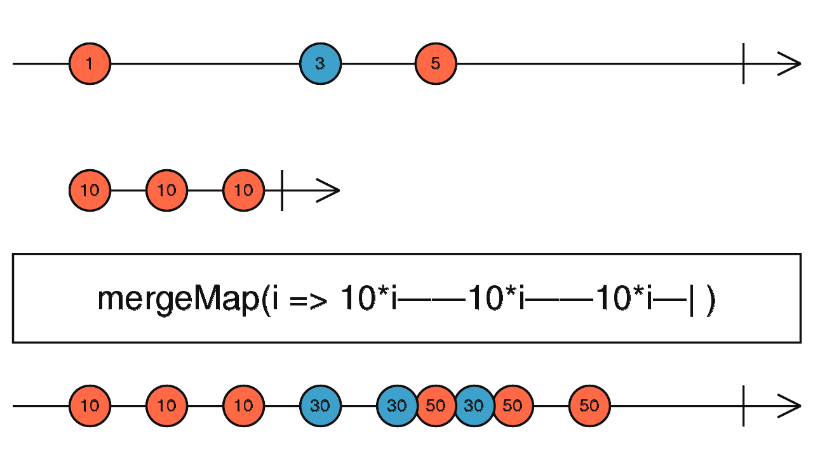

Khác với `switchMap()`, `mergeMap()` sẽ không `unsubscribe` `Inner Observable` cũ nếu như có `Inner Observable` mới. Nói đúng hơn, `mergeMap()` sẽ giữ nhiều `Subscription`. Vì tính chất này, `mergeMap()` thích hợp khi bạn có nghiệp vụ mà không cần/được dừng `Inner Observable` nếu như `Outer Observable` có emit giá trị mới (ví dụ những nghiệp vụ liên quan đến **Write vào Database**, `switchMap()` sẽ thích hợp với **Read**).

```ts
fromEvent(document, 'click').pipe(
  mergeMap(() => interval(1000).pipe(take(10)))
);

// Click, subscribe {1}
// {1}: 0 -- 1 -- 2 -- 3 -- 4
// Click, subscribe {2}
// {1}: 5 -- 6 -- 7 -- 8
// {2}: 0 -- 1 -- 2 -- 3
// Click, subscribe {3}
// {1}: 9 -- complete {1}
// {2}: 4 -- 5 -- 6 -- 7 -- 8 -- 9 -- complete {2}
// {3}: 0 -- 1 -- 2 -- 3 -- 4 -- 5 -- 6 -- 7 -- 8 -- 9 -- complete {3}
```

Các bạn đã thấy sự khác biệt với `switchMap()` rồi chứ? Vì `mergeMap()` sẽ không `unsubscribe` `Inner Observable` nên số lượng `Subscription` mà `mergeMap()` tạo ra có khi lên rất nhiều, các bạn chú ý khi dừng `mergeMap()` nhé. Không cẩn thận là ăn **Memory Leak** đấy.

Operator này còn nhận vào một tham số là `concurrent` giống như `merge` operator để control có bao nhiêu Inner Observable có thể chạy đồng thời.

Nếu bạn set `concurrent = 1` chúng ta sẽ có cách hoạt động tương tự như `concatMap` phía dưới.

#### concatMap()

`concatMap<T, R, O extends ObservableInput<any>>(project: (value: T, index: number) => O, resultSelector?: (outerValue: T, innerValue: ObservedValueOf<O>, outerIndex: number, innerIndex: number) => R): OperatorFunction<T, ObservedValueOf<O> | R>`

Giống với `mergeMap()` và `switchMap()`, `concatMap()` cũng nhận vào 1 `projectFunction` và `projectFunction` này cũng sẽ phải trả về 1 `Inner Observable`. Khác với `mergeMap()` và `switchMap()`, `concatMap()` sẽ `subscribe` vào `Inner Observable` và sẽ **CHỜ** cho đến khi `Inner Observable` này complete thì mới `subscribe` vào `Inner Observable` tiếp theo (nếu như có `Inner Observable` tiếp theo). Chúng ta sẽ tiếp tục phân tích lại ví dụ ở trên nhé:

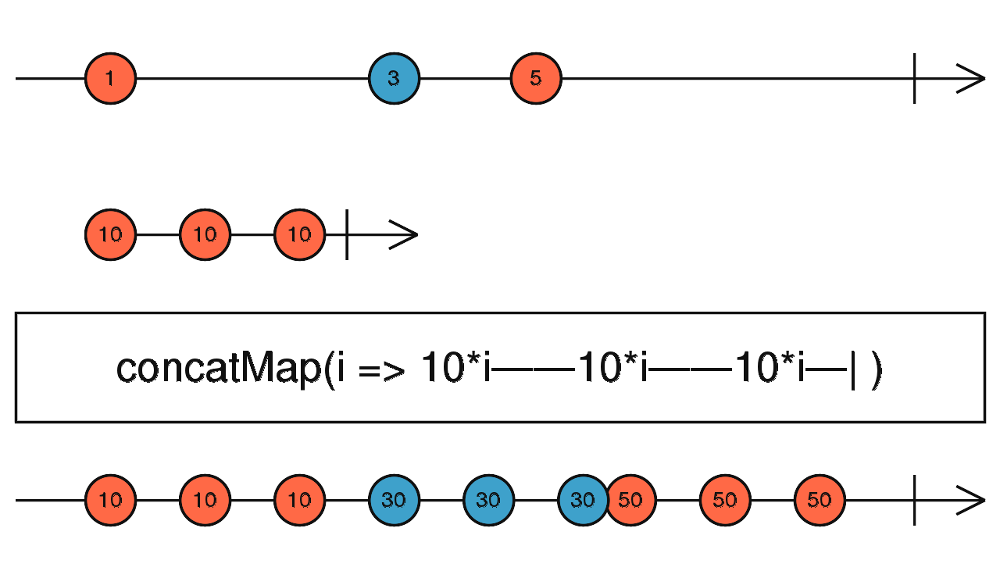

```ts
fromEvent(document, 'click').pipe(
  concatMap(() => interval(1000).pipe(take(5))) // mình giảm từ take(10) thành take(5) để type ít hơn 😅
);
// Click, subscribe {1}
// {1}: 0 -- 1 -- 2 --
// Click, không có gì xảy ra
// {1}: 3 -- 4 -- complete {1}
// subscribe {2}
// {2}: 0 -- 1
// Click, không có gì xảy ra
// {2}: 2 -- 3 -- 4 -- complete {2}
// subscribe {3}
// {3}: 0 -- 1 -- 2 -- 3 -- 4 -- complete {3}
```

Các bạn thấy chứ? `concatMap()` sẽ chờ cho đến khi `{1}` complete rồi mới `subscribe` vào `{2}` và tương tự cho `{3}`. Với tính chất này, `concatMap()` rất thích hợp trong các nghiệp vụ phải cần quan tâm đến **THỨ TỰ** thực hiện. Ví dụ: đèn giao thông, gọi số báo danh, hoặc nghiệp vụ dễ demo hơn là upload hình theo thứ tự.

```ts
from([image1, image2, image3]).pipe(
  // image1, image2, và image3 là loại dữ liệu File
  concatMap((singleImage) => this.apiService.upload(singleImage)) // upload từng image theo thứ tự
);
```

##### Lưu ý:

Như phần **Nguồn gốc** mình có đề cập tới `concatMap = concatAll + map`. Tuy nhiên, có một số trường hợp `concatAll + map` sẽ hoạt động không đúng với tính chất của `concatMap`. Điển hình chính là khi các bạn nhúng `Promise` vào. Các bạn xem ví dụ sau:

```ts
fromEvent(document, 'click').pipe(
  map(() => axios('...')),
  concatAll()
);
```

Lúc này, vì bản chất **eager** của `Promise`, khi được invoke là sẽ gửi request ngay lặp tức, nghĩa là `axios(...)` kia đã gửi request tại thời điểm `map()` mất rồi cho nên `concatAll()` ở đây để thực thi theo thứ tự thì hoàn toàn vô nghĩa, và nhiều trường hợp sẽ bị **Racing Condition** ngay.

#### exhaustMap()

`exhaustMap<T, R, O extends ObservableInput<any>>(project: (value: T, index: number) => O, resultSelector?: (outerValue: T, innerValue: ObservedValueOf<O>, outerIndex: number, innerIndex: number) => R): OperatorFunction<T, ObservedValueOf<O> | R>`

`exhaustMap()`, cũng như 3 HOOs trên, nhận vào 1 `projectFunction` và `projectFunction` này cũng sẽ phải trả về 1 `Inner Observable`. `exhaustMap()` sẽ `subscribe` vào `Inner Observable` này và trong khi `Inner Observable` đang emit (chưa complete) giá trị của nó mà có 1 `Inner Observable` mới (do `Outer Observable` emit giá trị mới, nhớ nha các bạn 👌) thì `Inner Observable` mới này sẽ bị **BỎ QUA** hoàn toàn khi `Inner Observable` cũ chưa complete.

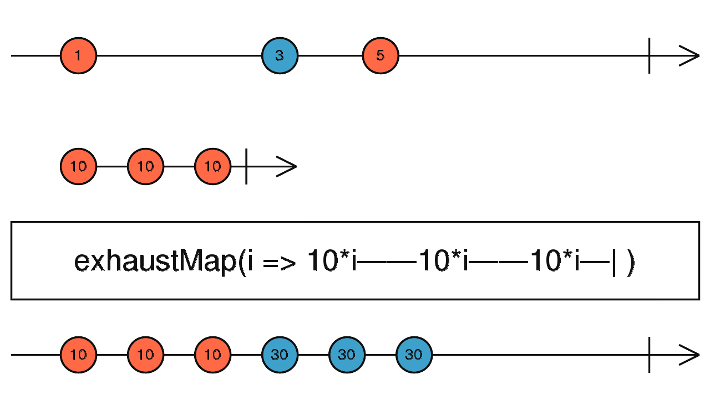

Cách hoạt động khá khá giống với `throttle` mà chúng ta đã tìm hiểu qua. Để thấy rõ được cách hoạt động của `exhaustMap()`, chúng ta xem qua ví dụ sau:

```ts
function log(val) {
  // helper function thôi
  console.log(val + ' emitted!!!');
  console.log('-----------------');
}

concat(
  timer(1000).pipe(map(() => 'first timer'), tap(log)), // emit "first timer" sau 1 giây
  timer(5000).pipe(map(() => 'second timer'), tap(log)), // emit "second timer" sau 5 giây
  timer(3000).pipe(map(() => 'last timer'), tap(log)) // emit "last timer" sau 3 giây
)
  .pipe(
    exhaustMap((c) =>
      interval(1000).pipe(
        map((v) => `${c}: ${v}`),
        take(4)
      )
    ) // interval(1000) này sẽ mất 4 giây để complete
  )
  .subscribe(console.log);

// Sau 1 giây:
// first timer emitted!! -- đây là hàm log
// first timer: 0
// first timer: 1
// first timer: 2
// first timer: 3 -- complete -- và lúc này 5 giây đã trôi qua

// second timer emitted!! -- đây là hàm log
// second timer: 0
// second timer: 1
// second timer: 2 -- lúc này 3 giây tiếp theo trôi qua
// last timer emitted!! -- đây là hàm log
// second timer: 3 -- complete
// KHÔNG CÒN GÌ XẢY RA
```

Các bạn có thể thấy là khi `exhaustMap()` đang chạy `Inner Observable` của `second timer` mà `last timer` emit, thì `exhaustMap()` bỏ qua hoàn toàn `Inner Observable` của `last timer` và mọi nghiệp vụ dừng lại sau khi `Inner Observable` của `second timer` complete. Đây là tính chất của `exhaustMap()`, là 1 trong những **Rate Limiting HOO** hiếm hoi 😎

#### switch/concat/mergeMapTo() (⚠️ Đã Deprecated từ RxJS 7+)

> [!WARNING]
> **Các toán tử `switchMapTo`, `concatMapTo`, `mergeMapTo` đã bị DEPRECATED từ RxJS 7.0 và bị loại bỏ trong RxJS 8.**
> - **Lý do:** Dư thừa API. Cú pháp viết trực tiếp `switchMap(() => inner$)` ngắn gọn và rõ ràng hơn mà không cần duy trì thêm các operators riêng biệt.
> - **Giải pháp thay thế:** Sử dụng toán tử mapping gốc với hàm trả về Observable: `switchMap(() => inner$)`, `mergeMap(() => inner$)`, `concatMap(() => inner$)`.

```ts
// Cách cũ (RxJS 6 - ĐÃ DEPRECATED):
// fromEvent(document, 'click').pipe(switchMapTo(interval(1000).pipe(take(10))));

// Cách chuẩn hiện đại (RxJS 7+):
fromEvent(document, 'click').pipe(switchMap(() => interval(1000).pipe(take(10))));

fromEvent(document, 'click').pipe(mergeMap(() => interval(1000).pipe(take(10))));

fromEvent(document, 'click').pipe(concatMap(() => interval(1000).pipe(take(10))));
```

#### partition()

`partition<T>(source: any, predicate: (value: T, index: number) => boolean, thisArg?: any): [Observable<T>, Observable<T>]`

`partition()` thực chất không phải là 1 HOO, mà nó là 1 HOF (Higher Order Function). Tuy nhiên, nếu xét về tính chất thì nó cũng nhận vào 1 `Source` và trả về, không chỉ 1, mà là 2 `Destination`. `partition()` nhận vào 2 tham số:

- `Source Observable`
- `predicateFunction`: `predicateFunction` này sẽ được invoke cho mỗi giá trị mà `Source Observable` emit.
  Với tham số `predicateFunction`, `partition()` sẽ **chia** `Source Observable` thành 2 `Destination Observables`: 1 `Observable` với giá trị thoả điều kiện của `predicateFunction`, `Observable` còn lại chứa giá trị không thoả điều kiện của `predicateFunction`.

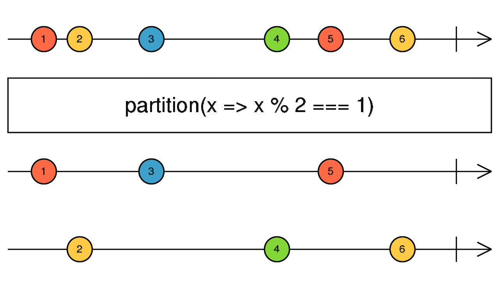

```ts
const [even$, odd$] = partition(interval(1000), (x) => x % 2 === 1);
merge(
  evens$.pipe(map((x) => `even - ${x}`)),
  odds$.pipe(map((x) => `odd - ${x}`))
).subscribe(console.log);

// even - 0
// odd - 1
// even - 2
// odd - 3
// ...
```

`partition()` cực kỳ hữu ích trong trường hợp 1 `WebSocket` về `notifications` từ backend và các bạn muốn phân chia thành `readNotification$` và `unreadNotification$` để xử lý 2 `Observables` này 1 cách khác nhau.

Trên đây là những HOOs thường dùng nhất trong **RxJS**. Ngoài ra, **RxJS** còn có các HOOs sau: `expand()`, `groupBy()`, và `mergeScan()`. Tuy nhiên, những HOOs này khá ít khi sử dụng, thực chất là mình chưa dùng qua những HOOs này bao giờ nên mình xin không đề cập đến. Các bạn có thể tự tìm hiểu nhé vì chúng khá dễ, ít nhất là dễ hiểu hơn so với mấy cái `switchMap()` rồi `concatMap()` kia 😛

## Utility Operators

Đúng với tên gọi, đây là những operators cung cấp 1 số tiện ích cho chúng ta mà đôi khi rất hiệu quả.

#### tap()

`tap<T>(observerOrNext?: Partial<Observer<T>> | ((value: T) => void)): MonoTypeOperatorFunction<T>`

> [!NOTE]
> Cú pháp truyền 3 callback riêng biệt `tap(nextFn, errorFn, completeFn)` đã bị **DEPRECATED** từ RxJS 7. Khuyên dùng một hàm duy nhất `tap(val => ...)` hoặc truyền vào Observer object: `tap({ next: (v) => ..., error: (e) => ..., complete: () => ... })`.

Ngoài hàm `subscribe` thì chắc `tap()` là 1 trong những operator được dùng nhiều nhất trong **RxJS**. `tap()` là 1 operator mà các bạn có thể `pipe` vào bất cứ `Observable` nào và tại bất cứ vị trí nào. `tap()` nhận vào tham số là `Observer` hoặc hàm `nextFunction`. Vì nhận vào tham số giống `subscribe`, nên bản chất `tap()` không trả về giá trị gì. Điều này nghĩa là `tap()` hoàn toàn không làm thay đổi bất cứ gì trên 1 `Observable`. Các bạn có thể dùng `tap()` để:

1. Log giá trị được emit ở bất cứ thời điểm nào trong Observable. Điều này giúp debug được giá trị của 1 Observable trước và sau khi dùng 1 operator nào đó.

```ts
interval(1000)
  .pipe(
    tap((val) => console.log('before map', val)),
    map((val) => val * 2),
    tap((val) => console.log('after map', val))
  )
  .subscribe();

// before map: 0
// after map: 0

// before map: 1
// after map: 2

// before map: 2
// after map: 4
// ...
```

2. Để thực thi 1 nghiệp vụ nào đó mà nghiệp vụ sử dụng giá trị của `Observable` emit và mutate giá trị đó. Việc này được coi là side effect đối với `Observable` hiện tại
3. Để thực thi 1 nghiệp vụ nào đó mà hoàn toàn không liên quan đến giá trị mà `Observable` emit. Ví dụ, để **start/stop** loader.

#### delay()/delayWhen()

`delay<T>(delay: number | Date, scheduler: SchedulerLike = async): MonoTypeOperatorFunction<T>`

`delay()` khá là dễ hiểu, chỉ là delay giá trị emit của 1 `Observable` nào đó dựa vào tham số truyền vào. Nếu như tham số truyền vào là `Number`, thì `delay()` sẽ chạy 1 timer với khoảng thời gian là tham số, sau đó sẽ emit giá trị của `Observable`. Nếu như tham số truyền vào là `Date`, thì `delay()` sẽ **hoãn** giá trị emit tới khi thời gian hiện tại bằng với `Date` được truyền vào.

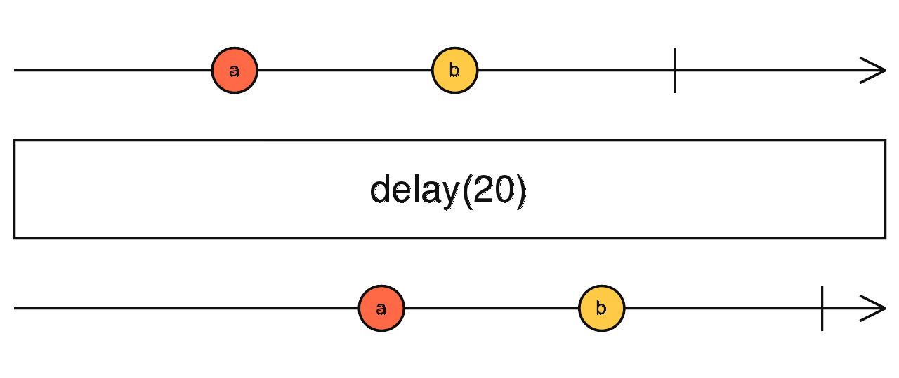

```ts
fromEvent(document, 'click').pipe(delay(1000)).subscribe(console.log);

// click
// 1s -- MouseEvent
// click
// 1s -- MouseEvent
```

`delayWhen<T>(delayDurationSelector: (value: T, index: number) => Observable<any>, subscriptionDelay?: Observable<any>): MonoTypeOperatorFunction<T>`

`delayWhen()` tính chất hoạt động giống như `delay()` nhưng thay vì truyền vào khoảng thời gian `Number` hoặc ngày `Date`, thì chúng ta truyền vào 1 function mà trả về 1 `Observable`. `delayWhen()` sẽ **hoãn** emit giá trị của `Source Observable` cho đến khi `Observable` truyền vào emit.

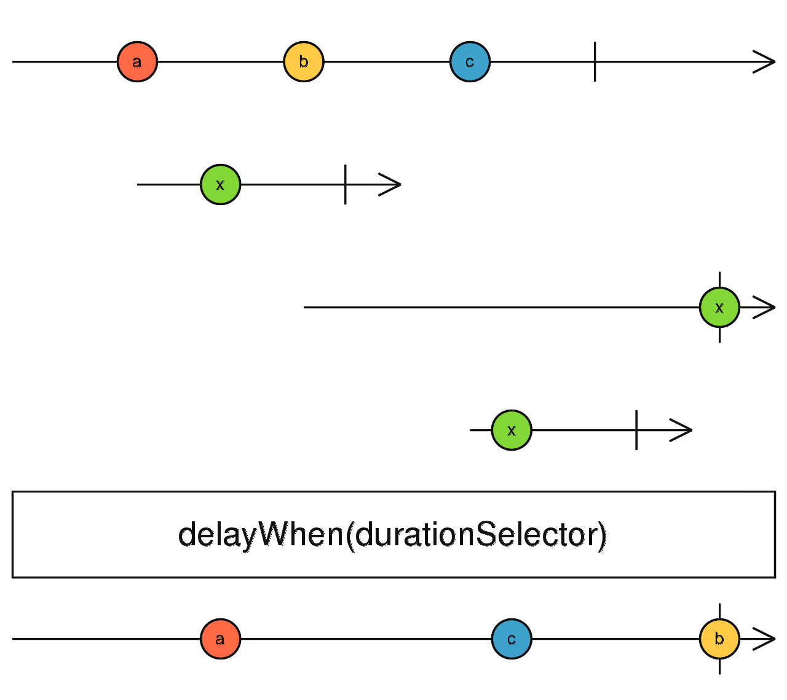

```ts
fromEvent(document, 'click')
  .pipe(delayWhen(() => timer(1000)))
  .subscribe(console.log);
// click
// 1s -- MouseEvent
// click
// 1s -- MouseEvent
```

#### finalize()

`finalize<T>(callback: () => void): MonoTypeOperatorFunction<T>`

`finalize()` rất đơn giản là 1 operator mà sẽ nhận vào 1 `callback`. `callback` này sẽ được thực thi khi `Observable` complete **hoặc** error. Use-case thường gặp nhất của `finalize()` chính là **stop loader/spinner**, vì chúng ta sẽ muốn cái loader/spinner dừng lại/không hiển thị khi 1 API Request thực hiện xong, cho dù có lỗi hay không có lỗi.

```ts
this.loading = true;
this.apiService
  .get()
  .pipe(finalize(() => (this.loading = false)))
  .subscribe();
```

#### repeat()

`repeat<T>(count: number = -1): MonoTypeOperatorFunction<T>`

`repeat()`, đúng như tên gọi, sẽ nhận vào tham số `count` và sẽ lặp lại `Source Observable` đúng với số `count` mà được truyền vào.

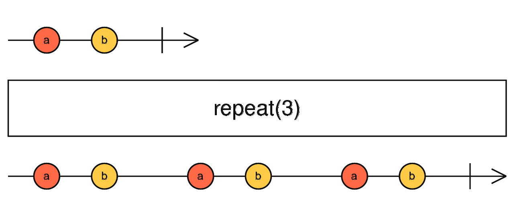

```ts
of('repeated data').pipe(repeat(3)).subscribe(console.log);
// 'repeated data'
// 'repeated data'
// 'repeated data'
```

#### timeInterval()

`timeInterval<T>(scheduler: SchedulerLike = async): OperatorFunction<T, TimeInterval<T>>`

`timeInterval()` dùng để đo khoảng thời gian giữa 2 lần emit của `Source Observable`. Ví dụ là tính thời gian giữa 2 lần click của người dùng. `timerInterval()` sẽ chạy timer ở thời điểm `Observable` được `subscribe`. Nghĩa là khi bắt đầu `subscribe` cho đến lúc có giá trị đầu tiên được emit, thì `timeInterval()` sẽ track được khoảng thời gian này.

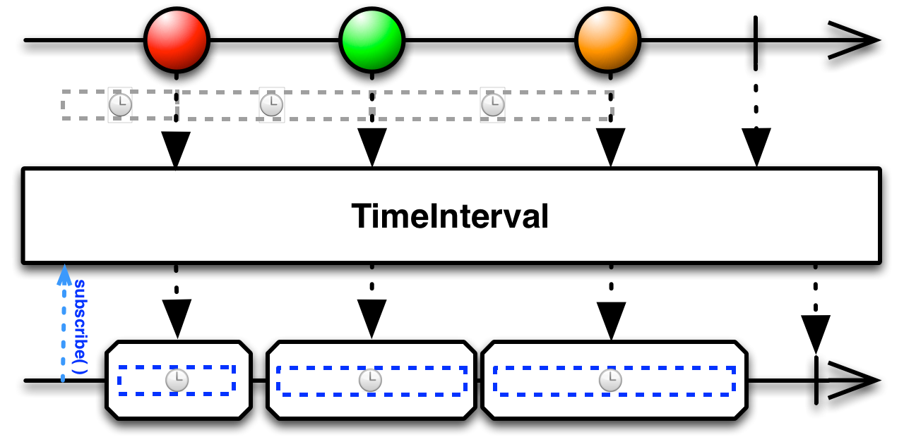

```ts
fromEvent(document, 'click').pipe(timeInterval()).subscribe(console.log);
// click
// TimeInterval {value: MouseEvent, interval: 1000 } // nghĩa là từ lúc subscribe đến lúc click lần đầu thì mất 1s
```

#### timeout()

`timeout<T>(due: number | Date, scheduler: SchedulerLike = async): MonoTypeOperatorFunction<T>`

`timeout()` nhận vào tham số giống như `delay()`, là 1 khoảng thời gian `Number` hoặc 1 ngày nào đó `Date`. `timeout()` sẽ throw error nếu như `Source Observable` không emit giá trị trong khoảng thời gian (nếu như tham số là `Number`) hoặc cho tới khi thời gian hiện tại bằng với ngày được truyền vào (nếu như tham số là `Date`).

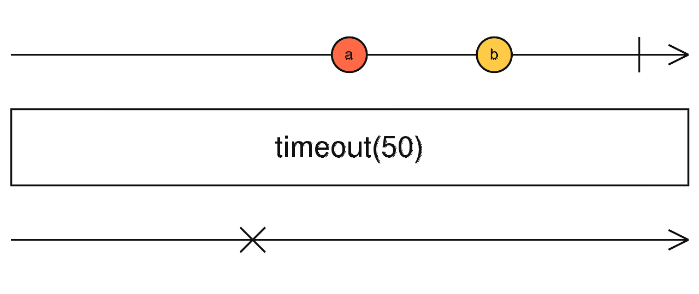

```ts
interval(2000).pipe(timeout(1000)).subscribe(console.log, console.error);

// Error { name: "TimeoutError" }
```

#### timeoutWith() (⚠️ Đã Deprecated từ RxJS 7+)

`timeoutWith<T, R>(due: number | Date, withObservable: any, scheduler: SchedulerLike = async): OperatorFunction<T, T | R>`

> [!WARNING]
> **Toán tử `timeoutWith` đã bị DEPRECATED từ RxJS 7.0 và bị loại bỏ trong RxJS 8.**
> - **Lý do:** Toán tử `timeout()` của RxJS 7+ đã được nâng cấp mạnh mẽ, cho phép truyền vào cấu hình object với thuộc tính `with: () => fallbackObservable`.
> - **Giải pháp thay thế:** Sử dụng `timeout({ each: dueTime, with: () => fallbackObservable })`.

```ts
// Cách cũ (RxJS 6 - ĐÃ DEPRECATED):
// interval(2000).pipe(timeoutWith(1000, of('fallback')));

// Cách chuẩn hiện đại (RxJS 7+): Sử dụng timeout() với cấu hình `with`
import { interval, of, timeout } from 'rxjs';

interval(2000).pipe(
  timeout({
    each: 1000,
    with: () => of('fallback khi quá thời gian chờ!'),
  })
).subscribe(console.log);
```

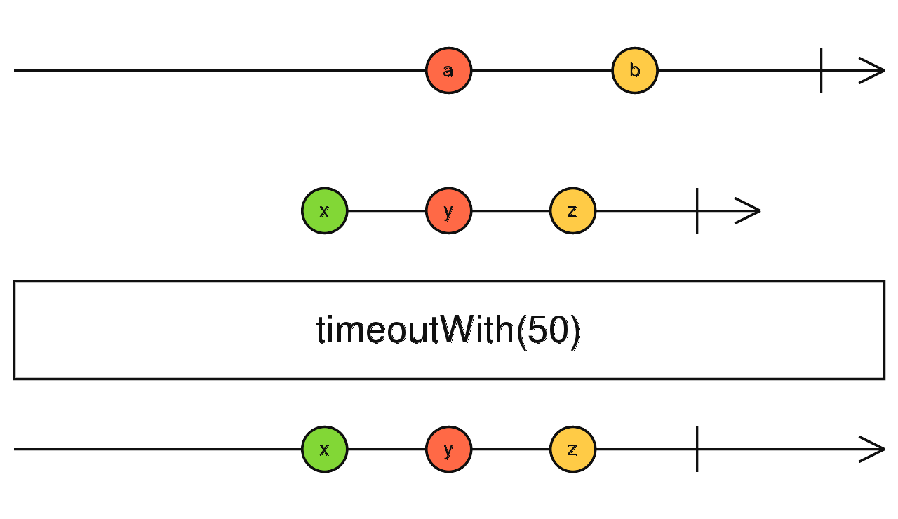

#### toPromise() (⚠️ Đã Deprecated từ RxJS 7+ và Bị Gỡ Bỏ trong RxJS 8)

> [!WARNING]
> **Phương thức `toPromise()` đã chính thức bị DEPRECATED từ RxJS 7.0 và bị LOẠI BỎ hoàn toàn trong RxJS 8.**
> - **Lý do:** `toPromise()` có hành vi không rõ ràng (chờ complete mới lấy giá trị cuối cùng hay lấy giá trị đầu tiên?), không an toàn khi stream rỗng (empty stream trả về `undefined` thay vì throw lỗi) và không nhất quán với triết lý của RxJS.
> - **Giải pháp thay thế:** RxJS 7+ cung cấp 2 hàm độc lập thay thế trực tiếp:
>   - **`firstValueFrom(observable$)`**: Chờ giá trị đầu tiên được emit, resolve Promise rồi tự hủy subscription. (Ném ra `EmptyError` nếu stream complete trước khi emit).
>   - **`lastValueFrom(observable$)`**: Chờ stream complete rồi resolve giá trị cuối cùng (hoạt động giống hệt `toPromise()` trước đây).

```ts
import { of, map, firstValueFrom, lastValueFrom } from 'rxjs';

async function testModern() {
  const source$ = of('hello').pipe(map((val) => val + ' World'));

  // Cách 1 (Phổ biến nhất): Lấy giá trị đầu tiên ngay khi có (rất phù hợp cho HTTP requests)
  const firstResult = await firstValueFrom(source$);
  console.log('firstValueFrom:', firstResult); // hello World

  // Cách 2: Chờ stream complete và lấy giá trị cuối cùng (thay thế chuẩn cho toPromise cũ)
  const lastResult = await lastValueFrom(source$);
  console.log('lastValueFrom:', lastResult); // hello World
}
```

Trên đây là các **Utility Operator** mà **RxJS** cung cấp. Sử dụng nhiều nhất chắc chắn là `tap()` vì các bạn sẽ dùng `tap()` để debug Observable Flow rất nhiều 😂

## Summary

Trong ngày hôm nay, chúng ta đã tìm hiểu những operators có thể nói là quan trọng nhất nhì trong **RxJS** và đặc biệt là trong **Angular** vì nhưng operators này giúp chúng ta xử lý được những Asynchronous Flow rất khéo léo. Nếu có 1 lời khuyên, mình khuyên các bạn hãy làm quen (thật quen) với 4 thằng `switch/concat/merge/exhaustMap()` thì công cuộc chinh phục **Angular** của các bạn sẽ dễ thở hơn rất nhiều.

Mục tiêu của ngày 26 sẽ là **RxJS Subject và Multicasting**

## References

- [RxJS Overview](https://rxjs.dev/guide/overview)
- [LearnRxJS](https://www.learnrxjs.io/)

## Youtube Video

[](https://youtu.be/5SD2YIxMBBM)

## Author

[Chau Tran](https://github.com/nartc)

`#100DaysOfCodeAngular` `#100DaysOfCode` `#AngularVietNam100DoC_Day25`
